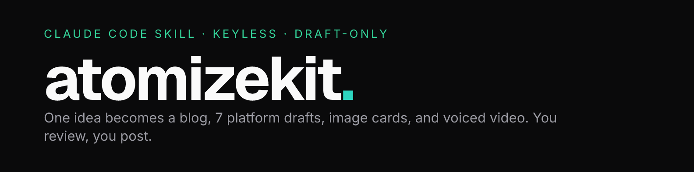

<p align="center">
  
</p>

# atomizekit

[](LICENSE)

Turn one idea into a week of content, without an API key and without letting a bot
hit "post."

atomizekit is a skill for Claude Code. You give it a topic; it writes a data-backed
blog post, spins that into native drafts for seven platforms, renders on-brand image
cards and voiced short-form video, and tracks which of your pages the AI answer
engines actually cite so it knows what to write next. Everything comes out as a
reviewable draft. You do the posting.

It configures itself to your brand. The first time you run it, it reads your codebase
(framework, blog folder, color tokens, logo, site name), asks you about the parts it
couldn't infer, and saves one config file. After that it just works.

## How it works

One blog post is the source of truth. Every platform variant links back to it, which
is what earns citations in ChatGPT, Perplexity, and Google's AI answers — a single
consistent source beats the same text sprayed everywhere. The loop:

```
topic  →  blog  →  7 platform drafts  →  image cards + reel + short  →  you review + post
  ↑                                                                          │
  └──────────  GEO tracker: what are we NOT cited for yet?  ←────────────────┘
```

No AI API key anywhere. Claude Code is the writer; the scripts are the render and
measurement machine. Nothing auto-posts, by design — platforms in 2026 penalize mass,
undisclosed automation, not human-reviewed native content. One human gate keeps the
whole thing inside every platform's terms of service.

## Install

```bash
# Recommended: Claude Code discovers skills here natively
git clone https://github.com/<owner>/atomizekit ~/.claude/skills/atomizekit

# or project-local, committed with your repo
git clone https://github.com/<owner>/atomizekit .claude/skills/atomizekit

# install the render dependencies
cd ~/.claude/skills/atomizekit && npm install
```

Also on the skills.sh registry:

```bash
npx skills add <owner>/atomizekit
```

One caveat: an open Claude Code issue ([#53950](https://github.com/anthropics/claude-code/issues/53950))
can drop `npx skills add` installs into a folder the Skill tool doesn't scan. If the
skill doesn't show up, use the manual `git clone` above.

## Quickstart

1. Open Claude Code in your project.
2. Say "set up atomizekit for my brand." It reads your codebase, asks a few questions,
   and writes `.claude/atomizekit.config.json`.
3. Say "make content about `<your topic>`." Out comes the blog, seven drafts, four
   image cards, and video — all as files.
4. Run `node scripts/dashboard.mjs` to review everything in one page, then post each
   draft yourself.

## What's inside

- A blog writer that structures posts to get quoted by AI answer engines (self-contained
  opener, real first-party data, schema).
- An atomizer that scaffolds seven platform variants, plus a per-platform voice playbook
  rebuilt from 2026 platform research (what X, LinkedIn, Reddit, Instagram, YouTube,
  Medium, and Substack actually reward now, and the AI-writing tells to strip).
- Image cards rendered in-process with takumi (four exact sizes, one real stat, no browser).
- Voiced video with hyperframes: a kinetic-text short and a stat reel, local Kokoro
  voiceover, real stock-footage beds. No AI-generated imagery.
- A GEO tracker that records which pages get cited, ranks the gaps by value, and feeds
  the next topic back to the top.
- A local review dashboard (`node scripts/dashboard.mjs`) that shows every draft and its
  media, themed to your brand, with a "mark posted" toggle.

## Repo layout

```
atomizekit/
├── SKILL.md              # the router Claude Code loads; first-run rule + pipeline
├── commands/             # step recipes: setup, write, atomize, visuals, dashboard
├── references/           # playbook (per-platform voice) + geo-writing rules
├── scripts/              # the machine
│   ├── lib_brand.mjs     # config loader (host config wins over skill default)
│   ├── atomize.py        # scaffold platform variants from a blog post
│   ├── render_cards.mjs  # image cards (takumi)
│   ├── render_reel.mjs   # voiced stat reel   } hyperframes
│   ├── render_short.mjs  # voiced short       }
│   ├── dashboard.mjs     # local review server (zero deps)
│   ├── geo/              # citation tracking: score, gap queue, measure, providers
│   └── tests/            # node:test suites
├── templates/            # card.jsx + video/ + shorts/ (HTML compositions)
└── brand/                # brand.template.json (the contract), fonts, placeholder logo
```

Your actual brand config lives in `.claude/atomizekit.config.json` inside your own
project, not in the skill. One install serves as many brands as you have projects.

## Prerequisites

- Node 22.15+, Python 3.
- FFmpeg 7+ and Chrome for video. Check with `npx hyperframes doctor --json`.
- Optional: `pip install kokoro-onnx soundfile` for voiceover (local, still no key), and
  a free `PEXELS_API_KEY` for stock-video beds. Without the key it falls back to
  keyless Openverse CC0 images.

Images need only Node, so `npm test` renders four demo cards on any machine.

## Third-party tools

atomizekit calls these as separate processes you install. It doesn't bundle their
source (gsap is the one vendored file, under its standard license):

- [takumi-js](https://github.com/kane50613/takumi) — JSX to PNG, in process (MIT)
- [hyperframes](https://github.com/heygen-com/hyperframes) — HTML to MP4 with local Kokoro TTS (Apache-2.0)
- [GSAP](https://gsap.com) — timeline animation, vendored into the video templates
- GEO tracker design owes its data model to geo-aeo-tracker (MIT)

## License

MIT © 2026 Karanjot Singh
